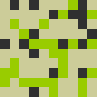

# Day 18: Settlers of The North Pole

On the outskirts of the North Pole base construction project, many Elves are
collecting lumber.

The lumber collection area is 50 acres by 50 acres; each acre can be either open
ground (`.`), trees (`|`), or a lumberyard (`#`). You take a scan of the area
(your puzzle input).

Strange magic is at work here: each minute, the landscape looks entirely
different. In exactly one minute, an open acre can fill with trees, a wooded
acre can be converted to a lumberyard, or a lumberyard can be cleared to open
ground (the lumber having been sent to other projects).

The change to each acre is based entirely on the contents of that acre as well
as the number of open, wooded, or lumberyard acres adjacent to it at the start
of each minute. Here, "adjacent" means any of the eight acres surrounding that
acre. (Acres on the edges of the lumber collection area might have fewer than
eight adjacent acres; the missing acres aren't counted.)

In particular:

- An open acre will become filled with trees if three or more adjacent acres
  contained trees. Otherwise, nothing happens.

- An acre filled with trees will become a lumberyard if three or more adjacent
  acres were lumberyards. Otherwise, nothing happens.

- An acre containing a lumberyard will remain a lumberyard if it was adjacent to
  at least one other lumberyard and at least one acre containing trees.
  Otherwise, it becomes open.

These changes happen across all acres simultaneously, each of them using the
state of all acres at the beginning of the minute and changing to their new form
by the end of that same minute. Changes that happen during the minute don't
affect each other.

For example, suppose the lumber collection area is instead only 10 by 10 acres
with this initial configuration:

    Initial state:
    .#.#...|#.
    .....#|##|
    .|..|...#.
    ..|#.....#
    #.#|||#|#|
    ...#.||...
    .|....|...
    ||...#|.#|
    |.||||..|.
    ...#.|..|.

    After 1 minute:
    .......##.
    ......|###
    .|..|...#.
    ..|#||...#
    ..##||.|#|
    ...#||||..
    ||...|||..
    |||||.||.|
    ||||||||||
    ....||..|.

    After 2 minutes:
    .......#..
    ......|#..
    .|.|||....
    ..##|||..#
    ..###|||#|
    ...#|||||.
    |||||||||.
    ||||||||||
    ||||||||||
    .|||||||||

    After 3 minutes:
    .......#..
    ....|||#..
    .|.||||...
    ..###|||.#
    ...##|||#|
    .||##|||||
    ||||||||||
    ||||||||||
    ||||||||||
    ||||||||||

    After 4 minutes:
    .....|.#..
    ...||||#..
    .|.#||||..
    ..###||||#
    ...###||#|
    |||##|||||
    ||||||||||
    ||||||||||
    ||||||||||
    ||||||||||

    After 5 minutes:
    ....|||#..
    ...||||#..
    .|.##||||.
    ..####|||#
    .|.###||#|
    |||###||||
    ||||||||||
    ||||||||||
    ||||||||||
    ||||||||||

    After 6 minutes:
    ...||||#..
    ...||||#..
    .|.###|||.
    ..#.##|||#
    |||#.##|#|
    |||###||||
    ||||#|||||
    ||||||||||
    ||||||||||
    ||||||||||

    After 7 minutes:
    ...||||#..
    ..||#|##..
    .|.####||.
    ||#..##||#
    ||##.##|#|
    |||####|||
    |||###||||
    ||||||||||
    ||||||||||
    ||||||||||

    After 8 minutes:
    ..||||##..
    ..|#####..
    |||#####|.
    ||#...##|#
    ||##..###|
    ||##.###||
    |||####|||
    ||||#|||||
    ||||||||||
    ||||||||||

    After 9 minutes:
    ..||###...
    .||#####..
    ||##...##.
    ||#....###
    |##....##|
    ||##..###|
    ||######||
    |||###||||
    ||||||||||
    ||||||||||

    After 10 minutes:
    .||##.....
    ||###.....
    ||##......
    |##.....##
    |##.....##
    |##....##|
    ||##.####|
    ||#####|||
    ||||#|||||
    ||||||||||

After 10 minutes, there are `37` wooded acres and `31` lumberyards. Multiplying
the number of wooded acres by the number of lumberyards gives the total resource
value after ten minutes: `37 * 31 = 1147`.

What will the total resource value of the lumber collection area be after 10
minutes?

## Part Two

This important natural resource will need to last for at least thousands of
years. Are the Elves collecting this lumber sustainably?

What will the total resource value of the lumber collection area be after
1000000000 minutes?
